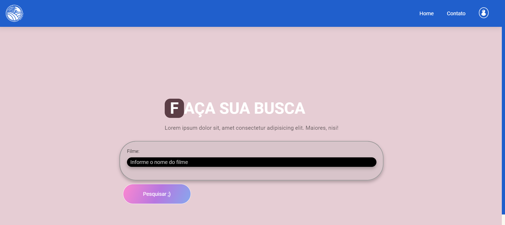

# express-server

Aplicação Node.JS + Express + Request API + Projeto Front

✅ Request API: Params + Query Part + URLEncoded + JSON. ✅ Design Responsive.

Runnig Project in PORT: 5000

Start Projetc: `node app.js`

Install Dependeces: `npm i`
