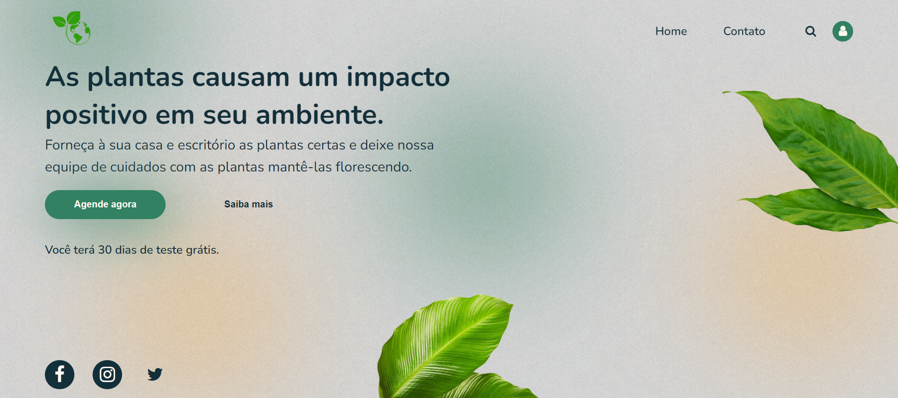

<h1 align="center">
  💻 Node Server - Design Patterns
</h1>

✅ Web Server.
✅ Design Responsivo.

Start Projetc: `node server.js (7070 - porta opcional)`

## 📚 Seções

O server é composto por duas páginas/rotas:

- **Home:** Nele temos uma breve apresentação;
- **Contato:** Nessa seção tenho um formulário de contato;

## 💼 Tecnologias utilizadas

Para o desenvolvimento deste site utilizei as seguintes tecnologias:

- HTML;
- CSS;
- JavaScript;
- Node.js;

<h2>🦄 Autor</h2>

<table>
  <tr>
    <td align="center">
      <a href="https://github.com/bhigoreduardo">
         
        
          <b>Higor Eduardo</b>
        
      </a>
    </td>
  </tr>
</table>
